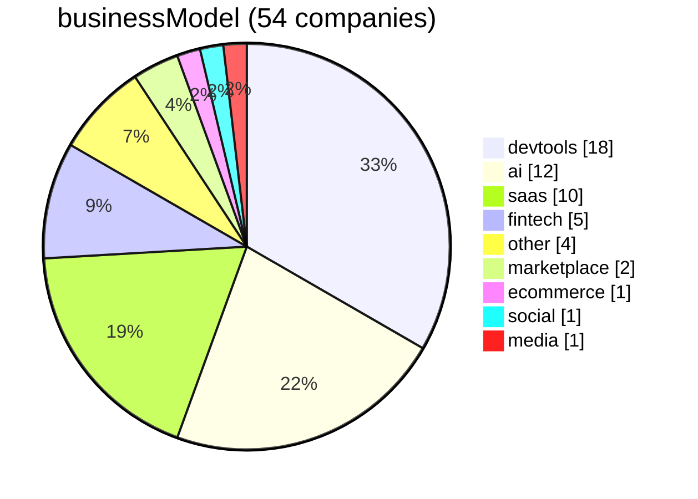
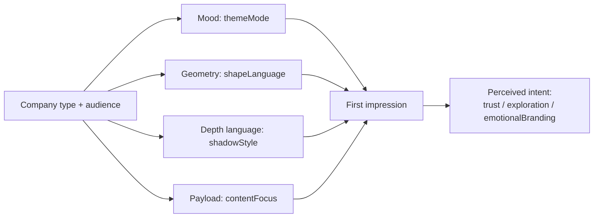

## Design System Feature-Table Analysis (v1 → robust companion)

Source of truth: `analysis/features.json` (54 companies, enums + notes).  
Clustering: `analysis/clusters.csv` (KMeans over one-hot encoded enum features; constant columns dropped).

This document is intentionally derived **only** from the feature table (not from any prior narrative analysis).

- **Public synthesis**: `ANALYSIS.md`
- **Role of this doc**: define terms, show distributions/cross-tabs, and provide traceability from each headline insight → table evidence.

---

## How to use this (designers + engineers)

- **If you’re a designer**: skim “Overview” + “Actual insights,” then use the traceability index to see what’s *measured vs inferred*.
- **If you’re an engineer**: focus on “Big levers,” cross-tabs, and limitations to understand what feature columns are actually doing.

## Method notes (what the table is / isn’t)

- **The table is a reduced representation**: each company is summarized into enums (e.g. `themeMode`, `contentFocus`). This is useful for comparison, but it compresses nuance.
- **“Evidence” in this doc means**: counts and cross-tabs over those enums. It does *not* establish causality.
- **Where a claim cannot be supported by table structure**, it should be treated as hypothesis or moved into the KG-backed narrative.

## Feature semantics (high-level)

These columns act like “first-impression levers.” They’re often more explanatory than brand/category labels:

- **Mood**: `themeMode` (light-first / dark-first / dual)
- **Geometry**: `shapeLanguage` (sharp / rounded / pill / mixed)
- **Depth language**: `shadowStyle` (none/subtle / stacked / ring)
- **Payload**: `contentFocus` (code-first / product screenshots / photography / illustration / mixed)
- **Intent (inference)**: `primaryIntent` (trust / exploration / emotionalBranding / unknown)

If you want to extend the table later, the most valuable upgrades are usually: tighter definitions + “unknown” discipline (don’t force a label without independent cues).

## Dataset snapshot

### Feature distributions (high-signal)

- **productType**: overwhelmingly `digital` (50/54); with `physical` (2), and singletons `marketplace` (1) and `mixed` (1).  
  Implication: most comparative claims will be about *types of digital products*, not physical vs digital.

- **businessModel**: skewed toward `other` (23), then `devtools` (14), then `saas` (11); small tails for `marketplace` (2), `ecommerce` (2), and singletons (`social`, `media`).  
  Implication: segmentation by `businessModel` is informative mainly at the level of: `other` vs `devtools` vs `saas`.

  **Update note:** `businessModel` was later refined and manually filled (no `unknown` remaining). Current distribution is: `devtools` (18), `ai` (12), `saas` (10), `fintech` (5), `other` (4), `marketplace` (2), and singletons (`ecommerce`, `social`, `media`).  
  Implication: future analysis should treat `ai` and `fintech` as first-class segments (not “other”).

- **At-a-glance: businessModel distribution (current)**

- **primaryIntent**: mostly `trust` (39), with smaller groups `exploration` (7) and `emotionalBranding` (7), plus `unknown` (1).  
  Implication: your decision rule is still “trust-seeking.” If you want more variation, tighten the rule for `trust` and/or bias toward `unknown` unless multiple independent cues align.

---

## Overview

This is the layer you can read before any charts or clustering. It’s derived from the feature table only.

### 1) Physical product brands use the interface to frame a single object

**Companies:** Apple, BMW

These companies treat the product photo as the centerpiece and keep everything else restrained. The feature table reflects that with `productType=physical` and `contentFocus=photography` for both, plus generally sparse/browsing layouts.

**What this achieves:** the product becomes the argument. UI components mainly annotate.

---

### 2) “Developer tools” behave like a recognizable genre

**Companies (examples):** Vercel, Raycast, Resend, Warp, VoltAgent, Cursor, Sentry, Figma

Across the table, `businessModel=devtools` is a meaningful bucket (18/54). These products disproportionately show:
- `contentFocus=codeFirst` or heavy product-screenshot storytelling
- more `darkFirst` theming than the “average SaaS marketing page”
- depth expressed through borders/shadows as a system (not just “one card shadow”)

**What this achieves:** instant credibility-by-aesthetic. The page signals “tooling” before you read the headline.

---

### 3) The default web “trust posture” is the majority style

**Companies:** too many to list — but it’s the center of gravity.

Most rows land on `primaryIntent=trust` (39/54). In plain language: most of these pages are trying to feel dependable and non-risky. Even when brand choices differ (color, type, mood), the posture tends to converge on clarity and legibility rather than surprise.

**What this achieves:** lower perceived risk. The design says “this will work” more than “this will delight.”

---

### 4) The biggest differences are controlled by a few “big levers”

If you want to quickly explain why two companies feel different, the table suggests starting with:
- **Mood**: `themeMode` (light-first vs dark-first vs dual)
- **Geometry**: `shapeLanguage` (sharp vs rounded vs pill vs mixed)
- **Depth language**: `shadowStyle` (none/subtle vs stacked vs ring)
- **Payload**: `contentFocus` (code vs product screenshots vs photography vs illustration)

**What this achieves:** a fast, non-jargony vocabulary for “why does this feel like *that*?”

---

### 5) “Exploration” and “emotional branding” are real minority strategies here

**Exploration examples:** Airbnb, Figma, Miro, Kraken  
**EmotionalBranding examples:** Claude, Clay, Lovable

These groups are smaller (7/54 each), but they’re important because they represent brands that prioritize either:
- browsing/discovery (“there’s lots here, go explore”), or
- world-building (“feel the brand”)

**What this achieves:** differentiation — at the cost of being less “default enterprise-neutral.”

## Segmentation (based on actual table, not clustering)

Clustering is useful, but the most defensible segmentation you can do *right now* is rule-based: slice by `businessModel`, then inspect how the other levers (theme, geometry, depth, payload) behave.

### Segment summary by `businessModel`

- **devtools (18)**: Composio, Cursor, Expo, Figma, MongoDB, PostHog, Raycast, Resend, Sanity, Sentry, Vercel, VoltAgent, Warp, …  
- **ai (12)**: Claude, ElevenLabs, MiniMax, Mistral AI, Replicate, Runway, Together AI, xAI, …  
- **saas (10)**: Airtable, Cal.com, Linear, Miro, Notion, Superhuman, Webflow, Zapier, …  
- **fintech (5)**: Coinbase, Kraken, Revolut, Stripe, Wise  
- **marketplace (2)**: Airbnb, Kraken (if treated as marketplace-like), …  
- **singletons**: ecommerce (Apple), social (Pinterest), media (Spotify)  
- **other (4)**: residual bucket (category doesn’t fit cleanly)

---

## Actual insights (from current distributions + cross-tabs)

### 1) Devtools overwhelmingly optimize for trust, not emotional branding

In the current table, `businessModel=devtools` maps to `primaryIntent=trust` **16/18**.

**What this suggests:** the dominant devtools posture is “reliable instrument panel,” not brand world-building.

### 2) AI is the split segment: it spans trust, exploration, and emotional branding

For `businessModel=ai`:
- `trust`: 5
- `exploration`: 2
- `emotionalBranding`: 5

**What this suggests:** “AI product” isn’t one aesthetic — some brands aim for authority, some for play, some for discovery.

### 3) SaaS is mostly trust, but allows occasional differentiation

For `businessModel=saas`: `trust` is **8/10**, with 1 exploration + 1 emotionalBranding.

**What this suggests:** SaaS pages can afford stylistic variety, but the default goal is still “feel safe.”

### 4) Theme mode differs by segment (but not as extremely as stereotypes)

- **devtools**: `darkFirst` 9, `lightFirst` 7, `dual` 2  
- **ai**: `lightFirst` 6, `darkFirst` 4, `dual` 2  
- **saas**: `lightFirst` 8, `darkFirst` 2

**What this suggests:** SaaS skews light-first; devtools and AI are both genuinely mixed.

### 5) Payload focus is the cleanest separator of “what kind of page is this?”

The table shows strong specialization:
- **devtools**: `codeFirst` **9/18** + `mixed` **5/18**  
- **saas**: `productScreenshots` **6/10**  
- **fintech**: `productScreenshots` **3/5**

**What this suggests:** “code payload vs UI payload vs editorial payload” explains more of the perceived differences than most other single columns.

---

## Limitations (important)

- **Category imbalance**: with 50/54 `productType=digital`, physical-vs-digital comparisons are underpowered.
- **Manual categorization risk**: `businessModel` is now fully filled (no `unknown`), which improves usability but increases the chance a few edge cases should be revisited later.

---

## Traceability index (ANALYSIS.md → evidence)

This section maps each headline insight from `ANALYSIS.md` to what the feature table can support today.

Legend:
- **[Table]**: supported by distributions/cross-tabs already present in this doc
- **[KG]**: supported primarily by KG quotes in `ANALYSIS.md` (not table-backed)
- **[Hypothesis]**: interpretation that should not be treated as measured

### Insight 1 (physical product → photography as interface layer)

- **Primary**: **[Table]** via `productType=physical` rows + their `contentFocus` values (note: \(n=2\), underpowered).
- **Secondary**: **[KG]** Apple/BMW quotes in `ANALYSIS.md`.
- **Caveat**: treat as illustrative pattern, not statistical claim.

### Insight 2 (physical product → proprietary typeface as “hardware asset”)

- **Primary**: **[KG]** (Apple SF is explicit; BMW is less explicit in current extracts).
- **Status**: **[Hypothesis]** framing (“hardware asset”) even when commissioning is factual.

### Insight 3 (fintech → flatness as trust signal)

- **Primary**: **[KG]** Revolut/Coinbase snippets.
- **Secondary**: **[Table]** fintech as a first-class segment + “big levers” analysis.
- **Status**: “flatness → transparency” is **[Hypothesis]** (interpretation).

### Insight 4 (fintech → typography as differentiator)

- **Primary**: **[KG]** (Coinbase font families, Wise Sans).
- **Status**: differentiator mechanism is **[Hypothesis]** unless the table adds explicit typography investment columns.

### Insight 5 (devtools → near-monochrome credibility)

- **Primary**: **[Table]** devtools distribution + theme-mode cross-tab (devtools: dark-first 9, light-first 7, dual 2).
- **Secondary**: **[KG]** Vercel “dark void + neon highlights” language.
- **Status**: “credibility signal” is **[Hypothesis]** (psychological mechanism).

### Insight 6 (devtools → monospace as identity)

- **Primary**: **[KG]** (Vercel Geist Mono, monospace nav).
- **Status**: **[Hypothesis]** as a generalized identity rule; table does not currently encode “monospace as brand font.”

### Insight 7 (AI → dark surfaces as intelligence positioning)

- **Primary**: **[Table]** “AI is the split segment” + theme-mode distribution (AI: light-first 6, dark-first 4, dual 2).
- **Secondary**: **[KG]** ElevenLabs/xAI dark-surface descriptions.
- **Status**: “dark = intelligence” is **[Hypothesis]**; the table actually shows AI is mixed, so the robust claim is about *variance*, not a single default.

### Insight 8 (code-first payload ⇒ trust)

- **[Table]**: `contentFocus=codeFirst` maps to `primaryIntent=trust` **13/13** in the current table.
- **Status**: the mapping is table-supported; the mechanism (“code = credibility”) is **[Hypothesis]**.

### Insight 9 (illustration/photography payload ⇒ mixed intent)

- **[Table]**: `contentFocus=illustration` distribution is **trust 4 / exploration 3 / emotionalBranding 2**.
- **[Table]**: `contentFocus=photography` distribution is **trust 2 / exploration 2 / emotionalBranding 3**.
- **Status**: table-supported for “mixed intent;” any causal story is **[Hypothesis]**.

### Insight 10 (productivity/SaaS → thin systems as strategy)

- **Primary**: **[Hypothesis]** (mechanism).
- **Secondary**: **[KG]** Notion shadow language.
- **To table-back later**: add columns for “system depth” proxies (token surface area, component count, motion system richness, etc.) or compute from documentation.

### Insight 11 (Do’s/Don’ts ↔ brand rigidity)

- **Primary**: **[KG]** presence of explicit constraint language.
- **Status**: correlation framing is **[Hypothesis]** until a table column explicitly encodes “dos/donts section present.”
