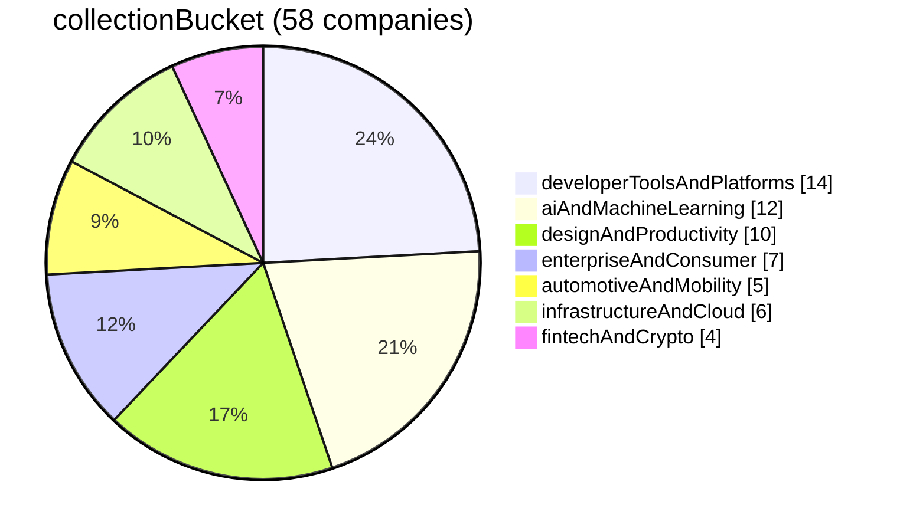
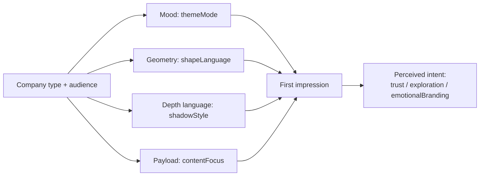

## Design System Feature-Table Analysis (v1 → robust companion)

Source of truth: `analysis/features.json` (58 companies, enums + notes).  
Clustering: `analysis/clusters.csv` (KMeans over one-hot encoded enum features; constant columns dropped).

This document is intentionally derived **only** from the feature table (not from any prior narrative analysis).

- **Public synthesis**: `ANALYSIS.md`
- **Role of this doc**: define terms, show distributions/cross-tabs, and provide traceability from each headline insight → table evidence.

---

## How to use this (designers + engineers)

- **If you’re a designer**: skim “Overview” + “Actual insights,” then use the traceability index to see what’s *measured vs inferred*.
- **If you’re an engineer**: focus on “Big levers,” cross-tabs, and limitations to understand what feature columns are actually doing.

## Method notes (what the table is / isn’t)

- **The table is a reduced representation**: each company is summarized into enums (e.g. `themeMode`, `contentFocus`). This is useful for comparison, but it compresses nuance.
- **“Evidence” in this doc means**: counts and cross-tabs over those enums. It does *not* establish causality.
- **Where a claim cannot be supported by table structure**, it should be treated as hypothesis or moved into the KG-backed narrative.

## Feature semantics (high-level)

These columns act like “first-impression levers.” They’re often more explanatory than brand/category labels:

- **Mood**: `themeMode` (light-first / dark-first / dual)
- **Geometry**: `shapeLanguage` (sharp / rounded / pill / mixed)
- **Depth language**: `shadowStyle` (none/subtle / stacked / ring)
- **Payload**: `contentFocus` (code-first / product screenshots / photography / illustration / mixed)
- **Intent (inference)**: `primaryIntent` (trust / exploration / emotionalBranding / unknown)

If you want to extend the table later, the most valuable upgrades are usually: tighter definitions + “unknown” discipline (don’t force a label without independent cues).

## Dataset snapshot

### Feature distributions (high-signal)

- **productType**: overwhelmingly `digital` (51/58); `physical` (6: Apple plus five automotive OEMs), and `marketplace` (1).  
  Implication: most comparative claims will still be about *types of digital products*, but physical/OEM rows are now large enough to compare as a small cohort.

- **`collectionBucket`**: aligns with the repo **README → Collection** headings **plus** **`automotiveAndMobility`** for car-manufacturer marketing sites (OEMs also appear under **Automotive & Mobility** in the README). One bucket per company; values are camelCase keys in `features.json`. Current distribution (58 companies):
  - `developerToolsAndPlatforms` (14)
  - `aiAndMachineLearning` (12)
  - `designAndProductivity` (10)
  - `enterpriseAndConsumer` (7) — *BMW moved to automotive; see below.*
  - `automotiveAndMobility` (5): BMW, Ferrari, Lamborghini, Renault, Tesla
  - `infrastructureAndCloud` (6)
  - `fintechAndCrypto` (4) — *Stripe is grouped under Infrastructure & Cloud in the README, not here.*

  Implication: segmentation is **editorial / collection-based** (with a dedicated automotive vertical in data and README). Use `productType` for marketplace vs physical vs digital product shape.

- **At-a-glance: `collectionBucket` distribution (current)**

- **primaryIntent**: mostly `trust` (40), with `exploration` (9) and `emotionalBranding` (9).  
  Implication: your decision rule is still “trust-seeking.” If you want more variation, tighten the rule for `trust` and/or bias toward `unknown` unless multiple independent cues align.

  **Full `emotionalBranding` set (9):** Claude, Clay, ElevenLabs, Ferrari, Lamborghini, Lovable, Mistral AI, Runway, SpaceX.

---

## Overview

This is the layer you can read before any charts or clustering. It’s derived from the feature table only.

### 1) Physical product brands use the interface to frame a single object

**Companies:** Apple; BMW, Ferrari, Lamborghini, Renault, Tesla

These companies treat the product photo (and, for some OEMs, cinematic video heroes) as the centerpiece and keep UI chrome restrained. The feature table reflects that with `productType=physical` and mostly `contentFocus=photography`; Lamborghini uses `contentFocus=mixed` to reflect video plus stills.

**What this achieves:** the product becomes the argument. UI components mainly annotate.

---

### 2) “Developer tools” behave like a recognizable genre

**Companies (examples):** Vercel, Raycast, Resend, Warp, Cursor, Sentry, Supabase (README: **Developer Tools & Platforms**)

Across the table, `collectionBucket=developerToolsAndPlatforms` is a meaningful bucket (14/58). These products disproportionately show:
- `contentFocus=codeFirst` or heavy product-screenshot storytelling
- more `darkFirst` theming than the “average SaaS marketing page”
- depth expressed through borders/shadows as a system (not just “one card shadow”)

**What this achieves:** instant credibility-by-aesthetic. The page signals “tooling” before you read the headline.

---

### 3) The default web “trust posture” is the majority style

**Companies:** too many to list — but it’s the center of gravity.

Most rows land on `primaryIntent=trust` (40/58). In plain language: most of these pages are trying to feel dependable and non-risky. Even when brand choices differ (color, type, mood), the posture tends to converge on clarity and legibility rather than surprise.

**What this achieves:** lower perceived risk. The design says “this will work” more than “this will delight.”

---

### 4) The biggest differences are controlled by a few “big levers”

If you want to quickly explain why two companies feel different, the table suggests starting with:
- **Mood**: `themeMode` (light-first vs dark-first vs dual)
- **Geometry**: `shapeLanguage` (sharp vs rounded vs pill vs mixed)
- **Depth language**: `shadowStyle` (none/subtle vs stacked vs ring)
- **Payload**: `contentFocus` (code vs product screenshots vs photography vs illustration)

**What this achieves:** a fast, non-jargony vocabulary for “why does this feel like *that*?”

---

### 5) “Exploration” and “emotional branding” are real minority strategies here

**Exploration examples:** Airbnb, Figma, Minimax, Miro, Pinterest, PostHog, Replicate, Renault, Spotify (by `primaryIntent`, not by collection bucket; fintech rows such as Kraken are `trust` in the table)  
**EmotionalBranding examples:** Claude, Clay, Runway, Ferrari, Lamborghini

These groups are smaller (9/58 and 9/58), but they’re important because they represent brands that prioritize either:
- browsing/discovery (“there’s lots here, go explore”), or
- world-building (“feel the brand”)

**What this achieves:** differentiation — at the cost of being less “default enterprise-neutral.”

## Segmentation (based on actual table, not clustering)

Clustering is useful, but the most defensible segmentation you can do *right now* is rule-based: slice by `collectionBucket` (README Collection), then inspect how the other levers (theme, geometry, depth, payload) behave.

### Segment summary by `collectionBucket`

- **developerToolsAndPlatforms (14)**: Cursor, Expo, Linear, Lovable, Mintlify, PostHog, Raycast, Resend, Sentry, Supabase, Superhuman, Vercel, Warp, Zapier  
- **aiAndMachineLearning (12)**: Claude, Cohere, ElevenLabs, MiniMax, Mistral AI, Ollama, OpenCode AI, Replicate, Runway, Together AI, VoltAgent, xAI  
- **designAndProductivity (10)**: Airtable, Cal.com, Clay, Figma, Framer, Intercom, Miro, Notion, Pinterest, Webflow  
- **infrastructureAndCloud (6)**: ClickHouse, Composio, HashiCorp, MongoDB, Sanity, Stripe  
- **fintechAndCrypto (4)**: Coinbase, Kraken, Revolut, Wise  
- **enterpriseAndConsumer (7)**: Airbnb, Apple, IBM, NVIDIA, SpaceX, Spotify, Uber  
- **automotiveAndMobility (5)**: BMW, Ferrari, Lamborghini, Renault, Tesla  

**Automotive segment (table snapshot):** `themeMode` is mixed (`dual` 3, `darkFirst` 1, `lightFirst` 1); `primaryIntent` mixes trust (2), emotionalBranding (2), and exploration (1). Payload is photography-led except Lamborghini (`mixed` for video + stills).

---

## Actual insights (from current distributions + cross-tabs)

### 1) Developer Tools & Platforms overwhelmingly optimize for trust, not emotional branding

In the current table, `collectionBucket=developerToolsAndPlatforms` maps to `primaryIntent=trust` **12/14** (PostHog → exploration; Lovable → emotionalBranding).

**What this suggests:** the dominant developer-tool posture is “reliable instrument panel,” not brand world-building.

### 2) AI & Machine Learning is the split segment: it spans trust, exploration, and emotional branding

For `collectionBucket=aiAndMachineLearning`:
- `trust`: 6
- `exploration`: 2
- `emotionalBranding`: 4

**What this suggests:** “AI product” isn’t one aesthetic — some brands aim for authority, some for play, some for discovery.

### 3) Design & Productivity is mostly trust, but allows exploration

For `collectionBucket=designAndProductivity`: `trust` is **6/10**, with 3 exploration + 1 emotionalBranding.

**What this suggests:** this README bucket still skews “feel safe,” but exploration is more common than in the developer-tools bucket.

### 4) Theme mode differs by segment (but not as extremely as stereotypes)

- **developerToolsAndPlatforms**: `lightFirst` 8, `darkFirst` 6  
- **aiAndMachineLearning**: `lightFirst` 5, `darkFirst` 5, `dual` 2  
- **designAndProductivity**: `lightFirst` 9, `darkFirst` 1

**What this suggests:** Design & Productivity skews light-first; developer tools and AI are both mixed.

### 5) Payload focus is the cleanest separator of “what kind of page is this?”

The table shows strong specialization:
- **developerToolsAndPlatforms**: `codeFirst` **4/14** + `productScreenshots` **4/14** + `mixed` **3/14**  
- **designAndProductivity**: `productScreenshots` **4/10** + `mixed` **3/10**  
- **fintechAndCrypto**: `productScreenshots` **2/4**, `codeFirst` **1/4**, `illustration` **1/4**

**What this suggests:** “code payload vs UI payload vs editorial payload” explains more of the perceived differences than most other single columns.

---

## Further table-derived analyses (58-company snapshot)

Additional slices that are easy to recompute from `features.json` and useful for segmentation or sanity checks.

### A) `uxMode` — browsing vs task vs build

| Value | Count |
|-------|------:|
| `browsingHeavy` | 25 |
| `mixed` | 14 |
| `taskFocused` | 12 |
| `creationTool` | 6 |
| `docsHeavy` | 1 |

**Implication:** the majority of rows read as **marketing / catalog / editorial scroll** surfaces, even when the underlying product is a dev tool or AI API. Task-focused and creation-tool modes are minorities—useful when comparing “homepage” vs “app shell” extracts.

### B) `imageryUsage` — “mixed” swamps the rest

| Value | Count |
|-------|------:|
| `mixed` | 44 |
| `imageFirst` | 13 |
| `textFirst` | 1 |

**Implication:** only a thin slice is unambiguously **image-first** in the enum sense; most brands blend photography, UI shots, and type. Claims about “photography-led” brands should lean on `contentFocus` and notes, not `imageryUsage` alone.

### C) `surfaceDepth` and `motionUsage`

**`surfaceDepth`:** `flat` 30, `layered` 22, `subtle` 6 — the collection skews toward **flat or lightly stacked** surfaces rather than heavy elevation systems.

**`motionUsage`:** `low` 30 vs `medium` 28 — almost **even split**; motion is not a strong separator in this table (no `high` labels in the current snapshot).

### D) `primaryIntent` × `contentFocus` (full grid)

Rows = `primaryIntent`, columns = `contentFocus` (counts):

|  | codeFirst | illustration | mixed | photography | productScreenshots |
|--|----------:|-------------:|------:|-------------:|-------------------:|
| **trust** | 13 | 4 | 9 | 3 | 11 |
| **exploration** | 0 | 3 | 1 | 3 | 2 |
| **emotionalBranding** | 0 | 2 | 3 | 4 | 0 |

**Implication:** `trust` is the only intent with **code-first** rows (and it owns all 13). **Exploration** never appears with `codeFirst` in this snapshot. **Emotional branding** shows up across illustration, mixed, and **photography** (4 rows: Ferrari, Mistral AI, Runway, SpaceX)—not only “illustration brands.”

### E) Automotive vs enterprise (consumer) — same table, different lever profile

Comparing `collectionBucket=automotiveAndMobility` (**5**) with `enterpriseAndConsumer` (**7**):

| Lever | Automotive (5) | Enterprise & consumer (7) |
|-------|----------------|----------------------------|
| `shapeLanguage` | `mixed` **4**, `sharp` 1 | `pill` 3, `sharp` 3, `rounded` 1 |
| `shadowStyle` | `none` **3**, `subtle` 1, `stacked` 1 | `subtle` 3, `none` 2, `stacked` 2 |
| `colorStrategy` | `singleAccent` 2, `multiAccent` 2, `gradientLed` 1 | `singleAccent` 5, `monochrome` 2 |
| `themeMode` | `dual` **3**, `darkFirst` 1, `lightFirst` 1 | `darkFirst` 4, `dual` 2, `lightFirst` 1 |

**Implication:** OEM rows skew **dual theme**, **mixed geometry** (pill search fields, modal radii, etc.), and **shadow-none** surfaces more than the enterprise bucket, which skews **pill** shapes and **single-accent / monochrome** color strategies. Both are still small-*n* cohorts—treat as directional.

### F) `colorStrategy=gradientLed` is rare and cross-bucket

**7 / 58** rows: Figma, Mintlify, Mistral AI, Replicate, Renault, Superhuman, Together AI (spans `designAndProductivity`, `developerToolsAndPlatforms`, `aiAndMachineLearning`, and `automotiveAndMobility`).

**Implication:** gradient-led marketing is **not** owned by one README collection; it is a deliberate accent strategy that shows up in dev docs brands, AI homepages, and Renault-style hero treatment alike.

### G) Co-occurrence: “flat dark” (`darkFirst` + `shadowStyle=none`)

**10 / 58** rows share **dark-first** theme and **no** shadow token emphasis: Lamborghini, OpenCode AI, Replicate, Revolut, Runway, Sanity, SpaceX, Supabase, Warp, x.ai.

**Implication:** a recognizable **flat dark canvas** pattern crosses fintech, AI, infrastructure, and automotive—depth comes from type, color, or imagery rather than elevation stacks.

---

## Limitations (important)

- **Category imbalance**: with 51/58 `productType=digital`, physical-vs-digital comparisons are still tilted toward digital, but the six `physical` rows (Apple + five OEMs) support qualitative OEM patterns.
- **Manual categorization risk**: `collectionBucket` is README- and script-aligned by construction; OEMs use `automotiveAndMobility` even though some also sell software. Edge cases that fit two README sections are forced into one bucket.

---

## Traceability index (ANALYSIS.md → evidence)

This section maps each headline insight from `ANALYSIS.md` to what the feature table can support today.

Legend:
- **[Table]**: supported by distributions/cross-tabs already present in this doc
- **[KG]**: supported primarily by KG quotes in `ANALYSIS.md` (not table-backed)
- **[Hypothesis]**: interpretation that should not be treated as measured

### Insight 1 (physical product → photography as interface layer)

- **Primary**: **[Table]** via `productType=physical` rows + their `contentFocus` values (note: \(n=6\); mostly photography, one `mixed` for video-heavy OEM).
- **Secondary**: **[KG]** Apple/BMW quotes in `ANALYSIS.md`.
- **Caveat**: treat as illustrative pattern, not statistical claim.

### Insight 2 (physical product → proprietary typeface as “hardware asset”)

- **Primary**: **[KG]** (Apple SF is explicit; BMW is less explicit in current extracts).
- **Status**: **[Hypothesis]** framing (“hardware asset”) even when commissioning is factual.

### Insight 3 (fintech → flatness as trust signal)

- **Primary**: **[KG]** Revolut/Coinbase snippets.
- **Secondary**: **[Table]** `fintechAndCrypto` as a small segment (4 rows) + “big levers” analysis.
- **Status**: “flatness → transparency” is **[Hypothesis]** (interpretation).

### Insight 4 (fintech → typography as differentiator)

- **Primary**: **[KG]** (Coinbase font families, Wise Sans).
- **Status**: differentiator mechanism is **[Hypothesis]** unless the table adds explicit typography investment columns.

### Insight 5 (developer tools → near-monochrome credibility)

- **Primary**: **[Table]** `developerToolsAndPlatforms` distribution + theme-mode cross-tab (dark-first 6, light-first 8).
- **Secondary**: **[KG]** Vercel “dark void + neon highlights” language.
- **Status**: “credibility signal” is **[Hypothesis]** (psychological mechanism).

### Insight 6 (developer tools → monospace as identity)

- **Primary**: **[KG]** (Vercel Geist Mono, monospace nav).
- **Status**: **[Hypothesis]** as a generalized identity rule; table does not currently encode “monospace as brand font.”

### Insight 7 (AI → dark surfaces as intelligence positioning)

- **Primary**: **[Table]** “AI is the split segment” + theme-mode distribution (`aiAndMachineLearning`: light-first 5, dark-first 5, dual 2).
- **Secondary**: **[KG]** ElevenLabs/xAI dark-surface descriptions.
- **Status**: “dark = intelligence” is **[Hypothesis]**; the table actually shows AI is mixed, so the robust claim is about *variance*, not a single default.

### Insight 8 (code-first payload ⇒ trust)

- **[Table]**: `contentFocus=codeFirst` maps to `primaryIntent=trust` **13/13** in the current table.
- **Status**: the mapping is table-supported; the mechanism (“code = credibility”) is **[Hypothesis]**.

### Insight 9 (illustration/photography payload ⇒ mixed intent)

- **[Table]**: `contentFocus=illustration` distribution is **trust 4 / exploration 3 / emotionalBranding 2**.
- **[Table]**: `contentFocus=photography` distribution is **trust 3 / exploration 3 / emotionalBranding 4**.
- **Status**: table-supported for “mixed intent;” any causal story is **[Hypothesis]**.

### Insight 10 (Design & Productivity → thin systems as strategy)

- **Primary**: **[Hypothesis]** (mechanism).
- **Secondary**: **[KG]** Notion shadow language.
- **To table-back later**: add columns for “system depth” proxies (token surface area, component count, motion system richness, etc.) or compute from documentation.

### Insight 11 (Do’s/Don’ts ↔ brand rigidity)

- **Primary**: **[KG]** presence of explicit constraint language.
- **Status**: correlation framing is **[Hypothesis]** until a table column explicitly encodes “dos/donts section present.”

### Insight 12 (UX mode → browsing-heavy marketing envelope)

- **[Table]**: `uxMode` distribution — `browsingHeavy` **25/58** vs `taskFocused` **12/58** vs `creationTool` **6/58** (see “Further table-derived analyses §A”).
- **Status**: descriptive; “why marketing pages converge” is **[Hypothesis]**.

### Insight 13 (flat dark canvas co-occurrence)

- **[Table]**: `themeMode=darkFirst` ∧ `shadowStyle=none` → **10/58** named rows (see “Further table-derived analyses §G”).
- **Status**: co-occurrence is table-backed; “flat dark = genre” is **[Hypothesis]**.

### Insight 14 (gradient-led color is cross-bucket)

- **[Table]**: `colorStrategy=gradientLed` → **7/58** across four `collectionBucket` values (see “Further table-derived analyses §F”).
- **Status**: table-backed; strategic interpretation is **[Hypothesis]**.
